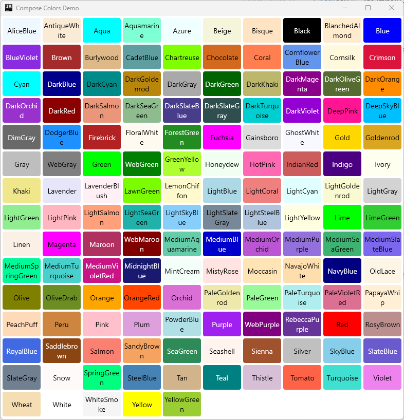
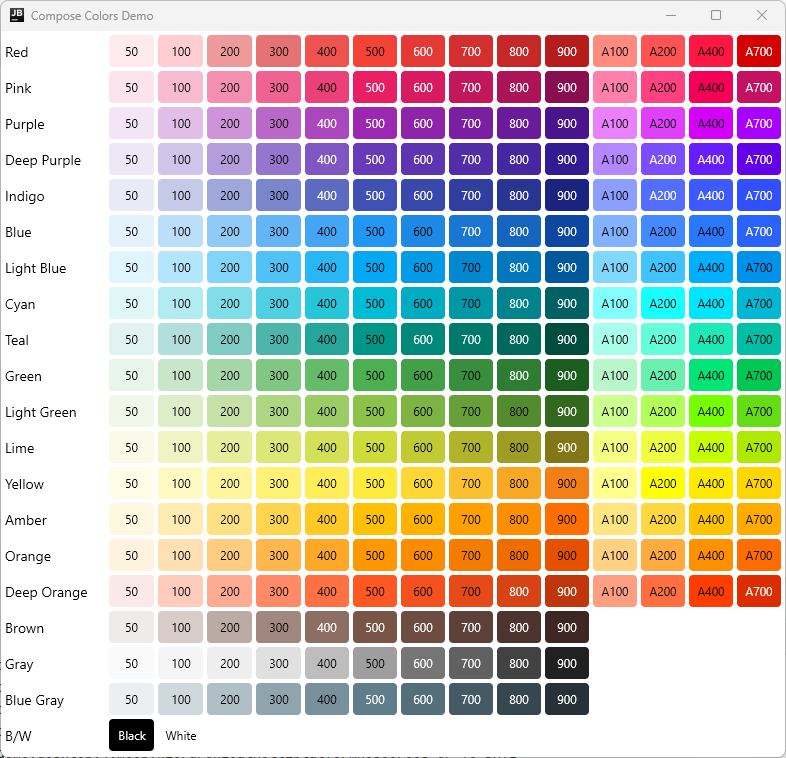

[](https://central.sonatype.com/artifact/io.github.mflisar.composecolors/core)   
# ComposeColors
     

This library offers you **compose color definitions** and optionally also palettes for the colors.

> [!NOTE]
> All features are splitted into separate modules, just include the modules you want to use!

# Table of Contents

- [Screenshots](#camera-screenshots)
- [Supported Platforms](#computer-supported-platforms)
- [Versions](#arrow_right-versions)
- [Setup](#wrench-setup)
- [Usage](#rocket-usage)
- [Demo](#sparkles-demo)
- [API](#books-api)
- [Other Libraries](#bulb-other-libraries)

# :camera: Screenshots




# :computer: Supported Platforms

| Module | android | iOS | windows | macOS | wasm |
|---|---|---|---|---|---|
| core | ✅ | ✅ | ✅ | ✅ | ✅ |
| material | ✅ | ✅ | ✅ | ✅ | ✅ |
| material-palette | ✅ | ✅ | ✅ | ✅ | ✅ |
| x11 | ✅ | ✅ | ✅ | ✅ | ✅ |
| x11-palette | ✅ | ✅ | ✅ | ✅ | ✅ |

# :arrow_right: Versions

| Dependency | Version |
|---|---|
| Kotlin | `2.3.20` |
| Jetbrains Compose | `1.10.3` |
| Jetbrains Compose Material3 | `1.9.0` |

# :wrench: Setup

<details open>

<summary><b>Using Version Catalogs</b></summary>

<br>

Define the dependencies inside your **libs.versions.toml** file.

```toml
[versions]

composecolors = "<LATEST-VERSION>"

[libraries]

composecolors-core = { module = "io.github.mflisar.composecolors:core", version.ref = "composecolors" }
composecolors-material = { module = "io.github.mflisar.composecolors:material", version.ref = "composecolors" }
composecolors-material-palette = { module = "io.github.mflisar.composecolors:material-palette", version.ref = "composecolors" }
composecolors-x11 = { module = "io.github.mflisar.composecolors:x11", version.ref = "composecolors" }
composecolors-x11-palette = { module = "io.github.mflisar.composecolors:x11-palette", version.ref = "composecolors" }
```

And then use the definitions in your projects **build.gradle.kts** file like following:

```java
implementation(libs.composecolors.core)
implementation(libs.composecolors.material)
implementation(libs.composecolors.material.palette)
implementation(libs.composecolors.x11)
implementation(libs.composecolors.x11.palette)
```

</details>

<details>

<summary><b>Direct Dependency Notation</b></summary>

<br>

Simply add the dependencies inside your **build.gradle.kts** file.

```kotlin
val composecolors = "<LATEST-VERSION>"

implementation("io.github.mflisar.composecolors:core:${composecolors}")
implementation("io.github.mflisar.composecolors:material:${composecolors}")
implementation("io.github.mflisar.composecolors:material-palette:${composecolors}")
implementation("io.github.mflisar.composecolors:x11:${composecolors}")
implementation("io.github.mflisar.composecolors:x11-palette:${composecolors}")
```

</details>

# :rocket: Usage

#### Basic examples

```kotlin

// returns instance of `androidx.compose.ui.graphics.Color`

// Material Colors
val red500 = MaterialColor.Red500
val blue500 = MaterialColor.Blue500
// ...

// X11 Colors
val aliceBlue = X11.AliceBlue
val antiqueWhite = X11.AntiqueWhite
// ...

```

#### Color Palettes

If desired, I offer `*-palette` modules that offer string names, enums and groups.

```kotlin

val palette = MaterialColor.Palette
when (palette) {
    is ColorPalette.Definition -> {
        // this palette does simple provide you a list of all available colors
        val paletteName: String = palette.name
        palette.colors.forEach {
            val colorName: String = it.name // e.g. AliceBlue, AntiqueWhite, Aqua, ...
            val color: Color = it.color
            // ...
        }
    }
    is ColorPalette.Grouped -> {
        val paletteName: String = palette.name
        palette.groups.forEach {
            val groupName: String = it.name // e.g. Red, Green, Blue, ...
            it.colors.forEach {
                val colorName: String = it.name  // e.g. Red500, Blue500, ...
                val color: Color = it.color
                // ...
            }
        }
    }
}
```

# :sparkles: Demo

A full [demo](/demo) is included inside the demo module, it shows nearly every usage with working examples.

# :books: API

Check out the [API documentation](https://MFlisar.github.io/ComposeColors/).

# :bulb: Other Libraries

You can find more libraries (all multiplatform) of mine that all do work together nicely [here](https://mflisar.github.io/Libraries/).
