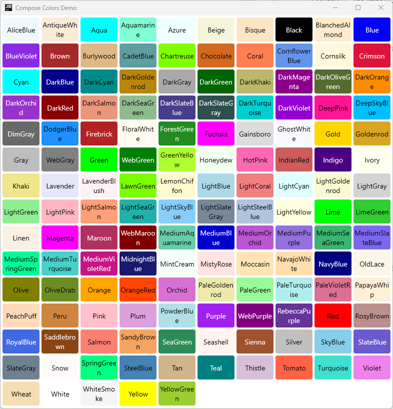

[](https://central.sonatype.com/namespace/io.github.mflisar.composecolors)
[](https://android-arsenal.com/api?level=21)
[](https://kotlinlang.org/)
[](https://kotlinlang.org/docs/multiplatform.html)
[](LICENSE)

<h1 align="center">ComposeColors</h1>

A simple collection of colors that can be used inside any KMP Compose project.

## :heavy_check_mark: Features

This library simple defines color constants for all `MaterialColors` or all `X11 colors`.

**All features are splitted into separate modules, just include the modules you want to use!**

## :camera: Screenshots

|        |  |
|:---------------------------------------------------------:|:-----------------------------------------:|
|                      Material Colors                      |                X11 Colors                 |

## :link: Dependencies

|      Dependency       | Version |                     Infos                      |
|:---------------------:|:-------:|:----------------------------------------------:|
| Compose Multiplatform | `1.7.0` | based on compose `1.7.1` and material3 `1.3.0` |

## :elephant: Gradle

This library is distributed via [maven central](https://central.sonatype.com/).

*build.gradle.kts*

```kts
val composecolors = "<LATEST-VERSION>"

// Definitions of all color constants
implementation("io.github.mflisar.composecolors:material:$composecolors")
implementation("io.github.mflisar.composecolors:x11:$composecolors")

// Definition of Palettes for easy iterations and string names
implementation("io.github.mflisar.composecolors:material-palette:$composecolors")
implementation("io.github.mflisar.composecolors:x11-palette:$composecolors")
```

## </> Usage

#### Basic Usage

```kotlin

// returns instance of `androidx.compose.ui.graphics.Color`

// Material Colors
val red500 = MaterialColor.Red500
val blue500 = MaterialColor.Blue500
// ...

// X11 Colors
val aliceBlue = X11.AliceBlue
val antiqueWhite = X11.AntiqueWhite
// ...

```

#### Advanced Usage

If desired, I offer `*-palette` modules that offer string names, enums and groups.

```kotlin

val palette = MaterialColor.Palette
when (palette) {
    is ColorPalette.Definition -> {
        // this palette does simple provide you a list of all available colors
        val paletteName: String = palette.name
        palette.colors.forEach {
            val colorName: String = it.name // e.g. AliceBlue, AntiqueWhite, Aqua, ...
            val color: Color = it.color
            // ...
        }
    }
    is ColorPalette.Grouped -> {
        val paletteName: String = palette.name
        palette.groups.forEach {
            val groupName: String = it.name // e.g. Red, Green, Blue, ...
            it.colors.forEach {
                val colorName: String = it.name  // e.g. Red500, Blue500, ...
                val color: Color = it.color
                // ...
            }
        }
    }
}
```

## :computer: Supported Platforms

**Supported Platforms**

This is a **KMP (kotlin multiplatform)** library and the provided modules do support following platforms:

| Modules  | Android | iOS | jvm | js |
|:---------|---------|-----|-----|----|
| material | √       | √   | √   | √  |
| x11      | √       | √   | √   | √  |

## :tada: Demo

A full [demo](demo) is included inside the demo module, it shows nearly every usage with working examples.