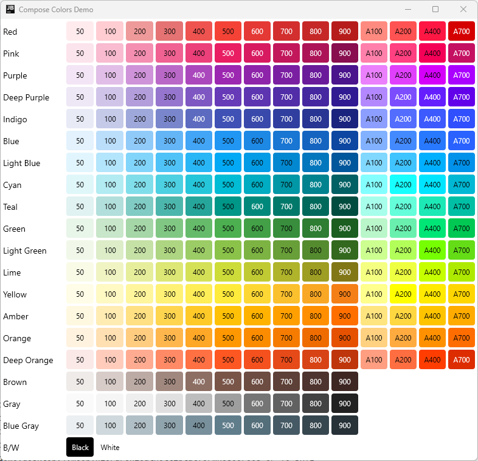

[](https://central.sonatype.com/namespace/io.github.mflisar.composecolors)
[](https://android-arsenal.com/api?level=21)
[](https://kotlinlang.org/)
[](https://kotlinlang.org/docs/multiplatform.html)
[](LICENSE)

<h1 align="center">ComposeColors</h1>

A simple collection of colors that can be used inside any KMP Compose project.

## :heavy_check_mark: Features

This library simple defines color constants for all `MaterialColors` or all `X11 colors`.

**All features are splitted into separate modules, just include the modules you want to use!**

## :camera: Screenshots

|        |  |
|:---------------------------------------------------------:|:-----------------------------------------:|
|                      Material Colors                      |                X11 Colors                 |

## :elephant: Gradle

This library is distributed via [maven central](https://central.sonatype.com/).

*build.gradle.kts*

```kts
val composecolors = "<LATEST-VERSION>"

implementation("io.github.mflisar.composecolors:material:$composecolors")
implementation("io.github.mflisar.composecolors:x11:$composecolors")
```

## </> Usage

```kotlin

// returns instance of `androidx.compose.ui.graphics.Color`

// Material Colors
val red500 = MaterialColor.Red500

// X11 Colors
val aliceBlue = X11.AliceBlue
```

## :computer: Supported Platforms

**Supported Platforms**

This is a **KMP (kotlin multiplatform)** library and the provided modules do support following platforms:

| Modules  | Android | iOS | jvm | js |
|:---------|---------|-----|-----|----|
| material | √       | √   | √   | √  |
| x11      | √       | √   | √   | √  |